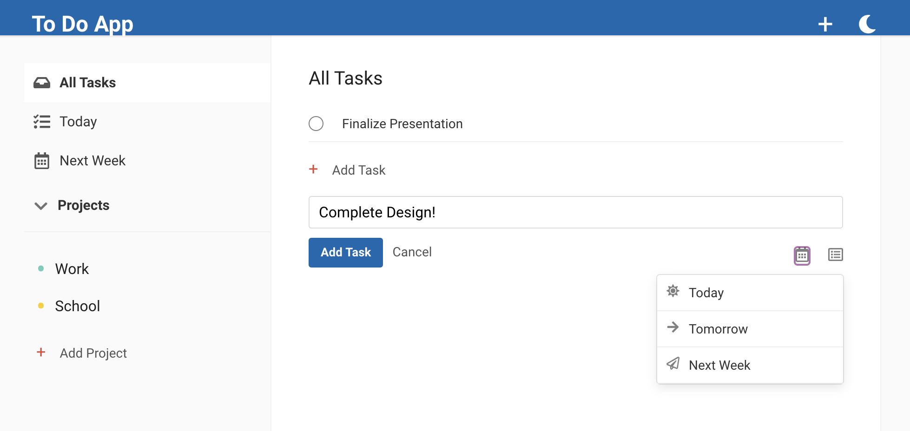

# To Do App
This project is a To-Do List App created in order to gain more practice with React (Custom Hooks, Context). Additionally, the app relies on Firebase as the main database for projects and tasks. 

Users can add Projects in the sidebar, or use quick-add options in the header. When adding a task, select the time-frame and project to add the task to. Be sure to try dark mode by clicking the moon in the top right. 

## How to run: 

 `npm start`

Runs the app in the development mode. 
Open [http://localhost:3000](http://localhost:3000) to view it in the browser.

The page will reload if you make edits. 

This project was bootstrapped with [Create React App](https://github.com/facebook/create-react-app) and based on https://www.youtube.com/watch?v=hT3j87FMR6M&t=478s. 
